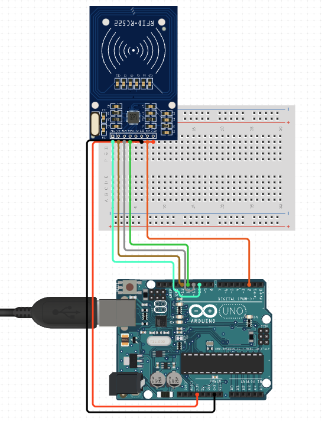

---

title:  "使用 Arduino 改寫卡片 UID"

description: "展示使用 Arduino 改寫卡片 UID"

date: 2023-06-15

draft: false

categories:

- 技術筆記

tags:

- 教學
- Arduino
- RFID

keywords:

- 教學
- Arduino
- RFID

---


## 簡單說明

- 注意購買白卡時要注意使可以改UID的，一般購買套裝系列的白卡都是不能改UID。
- 以下示例僅做UID修改，不做其他sector修改。

## BOM表

- Arduino Uno
- 麵包板
- RFID RC-522
- 7條杜邦線

## 接線實作



## 程式實作

### **安裝函式庫**

****Arduino IDE****程式管理員中直接下載MFRC522函式庫。

### **讀取UID**

上傳完程式後，將卡片放到感應機上，從console介面中觀察卡片UID，並記錄起來。

```cpp
#include <SPI.h>
#include <MFRC522.h>

#define RST_PIN         9          // Configurable, see typical pin layout above
#define SS_PIN          10         // Configurable, see typical pin layout above

MFRC522 mfrc522(SS_PIN, RST_PIN);  // Create MFRC522 instance

void setup() {
	Serial.begin(9600);		// Initialize serial communications with the PC
	while (!Serial);		// Do nothing if no serial port is opened (added for Arduinos based on ATMEGA32U4)
	SPI.begin();			// Init SPI bus
	mfrc522.PCD_Init();		// Init MFRC522
	delay(4);				// Optional delay. Some board do need more time after init to be ready, see Readme
	mfrc522.PCD_DumpVersionToSerial();	// Show details of PCD - MFRC522 Card Reader details
	Serial.println(F("Scan PICC to see UID, SAK, type, and data blocks..."));
}

void loop() {
	// Reset the loop if no new card present on the sensor/reader. This saves the entire process when idle.
	if ( ! mfrc522.PICC_IsNewCardPresent()) {
		return;
	}

	// Select one of the cards
	if ( ! mfrc522.PICC_ReadCardSerial()) {
		return;
	}

	// Dump debug info about the card; PICC_HaltA() is automatically called
	mfrc522.PICC_DumpToSerial(&(mfrc522.uid));
}
```

### **更改UID**

將記錄起來的UID填在這`#define NEW_UID {UID}`。上傳完程式後，將卡片放到感應機上，即可寫入UID。

```cpp
#include <SPI.h>
#include <MFRC522.h>

#define RST_PIN   9     // Configurable, see typical pin layout above
#define SS_PIN    10    // Configurable, see typical pin layout above

MFRC522 mfrc522(SS_PIN, RST_PIN);   // Create MFRC522 instance

/* Set your new UID here! */
#define NEW_UID {0x32, 0xD3 , 0xD4, 0x6C}

MFRC522::MIFARE_Key key;

int LED = 13;

void setup() {
  pinMode(LED,OUTPUT);
  Serial.begin(9600);  // Initialize serial communications with the PC
  while (!Serial);     // Do nothing if no serial port is opened (added for Arduinos based on ATMEGA32U4)
  SPI.begin();         // Init SPI bus
  mfrc522.PCD_Init();  // Init MFRC522 card
  Serial.println(F("Warning: this example overwrites the UID of your UID changeable card, use with care!"));
  
  // Prepare key - all keys are set to FFFFFFFFFFFFh at chip delivery from the factory.
  for (byte i = 0; i < 6; i++) {
    key.keyByte[i] = 0xFF;
  }
}

void loop() {
  
  // Reset the loop if no new card present on the sensor/reader. This saves the entire process when idle. And if present, select one.
  if ( ! mfrc522.PICC_IsNewCardPresent() || ! mfrc522.PICC_ReadCardSerial() ) {
    delay(50);
    return;
  }
    
  // Dump UID
  Serial.print(F("Card UID:"));
  for (byte i = 0; i < mfrc522.uid.size; i++) {
    Serial.print(mfrc522.uid.uidByte[i] < 0x10 ? " 0" : " ");
    Serial.print(mfrc522.uid.uidByte[i], HEX);
  } 
  Serial.println();

  // Set new UID
  byte newUid[] = NEW_UID;
  if ( mfrc522.MIFARE_SetUid(newUid, (byte)4, true) ) {
    Serial.println(F("Wrote new UID to card."));
    digitalWrite(LED,HIGH);
    delay(1000);
  }
  
  // Halt PICC and re-select it so DumpToSerial doesn't get confused
  mfrc522.PICC_HaltA();
  if ( ! mfrc522.PICC_IsNewCardPresent() || ! mfrc522.PICC_ReadCardSerial() ) {
    return;
  }
  
  delay(1000);
}
```