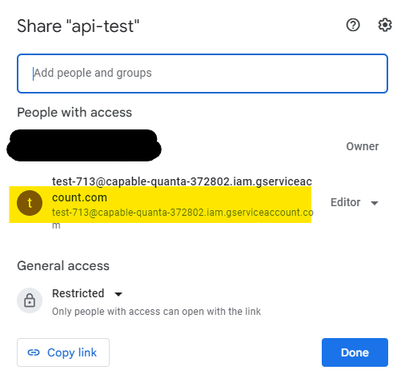

---

title:  "使用 Google Sheets 作為免費資料庫"

description: "展示如何使用Google Sheets 作為免費資料庫"

date: 2023-09-15

draft: false

categories: 

- 技術筆記

tags: 

- 教學
- 資料庫
- Google Sheets
- Javascript
- Node.js

keywords:

- 教學
- 資料庫
- Google Sheets
- Javascript
- Node.js

---


## 申請憑證

1. 建立專案 ([Google Developers Console連結](https://console.developers.google.com/))
    
    .png " ")
    
2. 開啟API服務
    
    .png " ")
    
3. 開啟服務
    
    .png " ")
    
4. 開啟KEY
    
    .png " ")
    
5. 在雲端中建立新的檔案，並開啟分享新增權限。
    
    
    

## 使用方式

1. 安裝套件
    
    ```bash
    npm install google-spreadsheet
    ```
    
2. 撰寫程式碼
    
    ```jsx
    // https://docs.google.com/spreadsheets/d/{表單id}/edit#gid=0
    const { GoogleSpreadsheet } = require('google-spreadsheet');
    
    const doc = new GoogleSpreadsheet('1a3zxgrlg9Ll1MGte7L_TjOiCj-rAUv1Q76E4sXoFPjo');
    
    async function init(){
        const creds = require('./credentials.json');
        await doc.useServiceAccountAuth(creds);
        await doc.loadInfo()
        const sheet = doc.sheetsByIndex[0];
    
        const larryRow = await sheet.addRow({ time: 'ttt', name: 'ttt' , male: 'ttt' , comment: 'ttt' });
        const ff = await doc.addSheet({ headerValues: ['name', 'email'] });
    
        // const rows = await sheet.getRows();
        // console.log(rows[0]);
    }
    
    init()
    ```