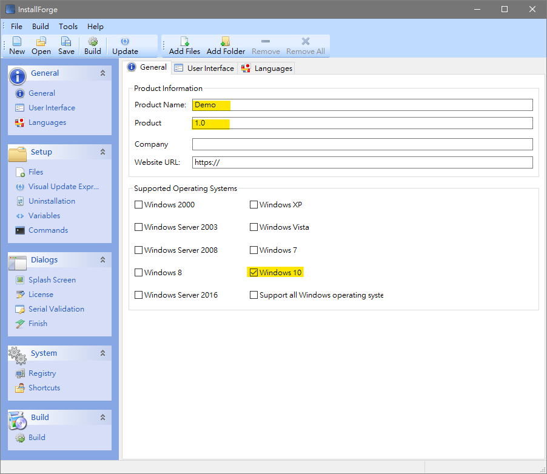
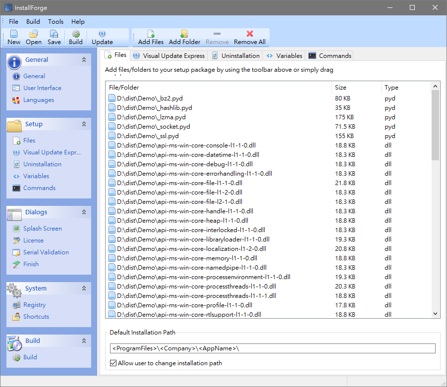
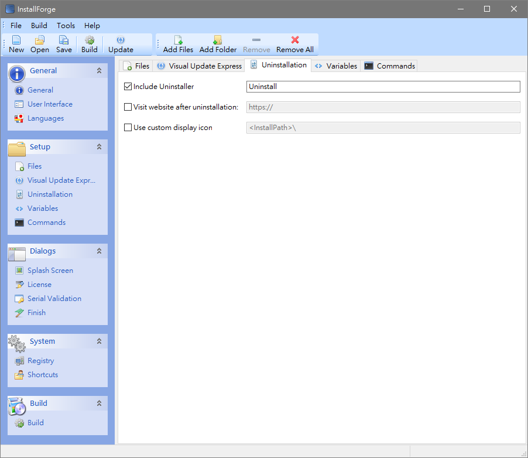
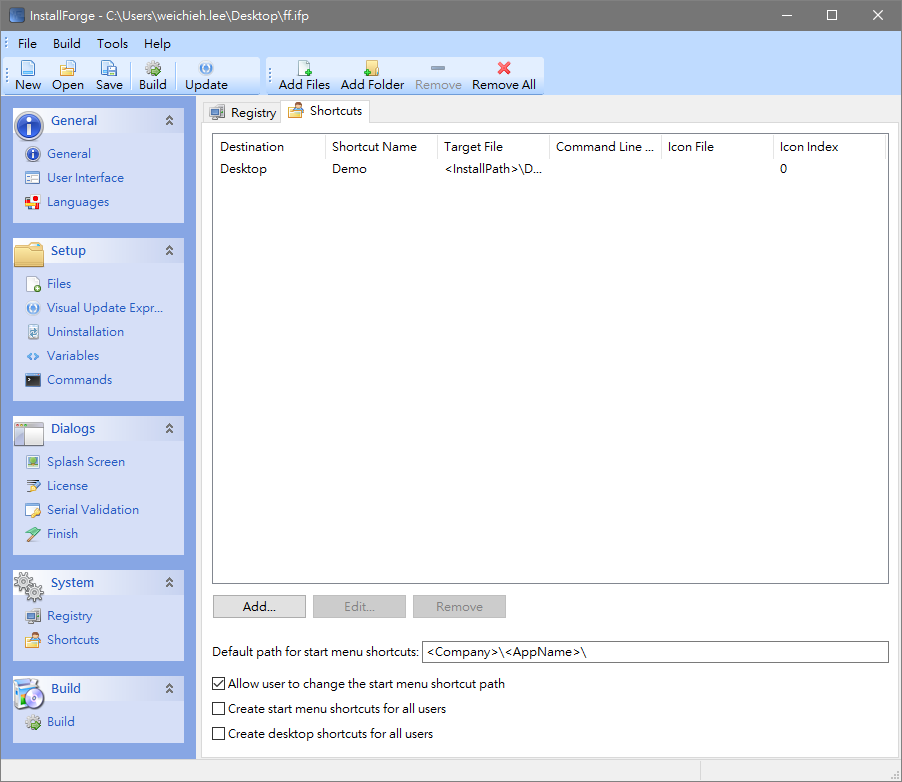
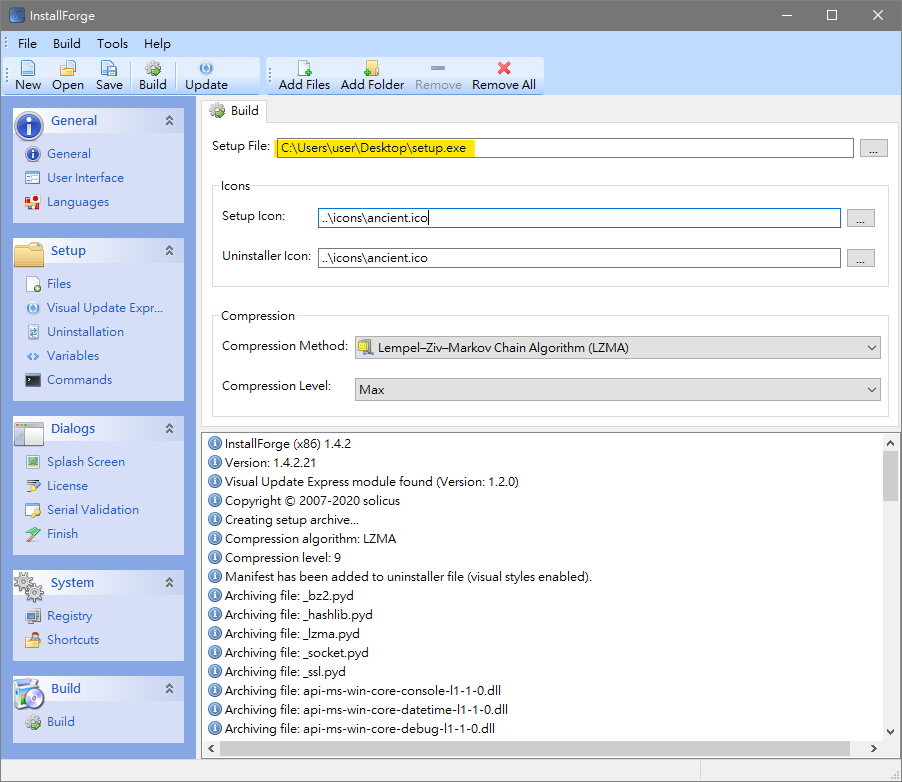

## 安裝****InstallForge****

[點擊此](https://installforge.net/download/#)到官網下載，並安裝。

## 實作建構安裝包

打開InstallForge後，依照各個頁面進行基礎設定。

### General頁面

填上應用程式的一些基本資料，包括名稱、版本。還可以從可用的各種 Windows 版本中選擇安裝程序的目標平台。

### Setup頁面

添加所有需要打包的檔案。這邊點擊`Add Files` 一次新增檔案，接著在點擊`Add Folder`一個一個新增目錄。

勾選`Include Uninstaller` ，往後可以直接解除程式使用。

### System頁面

添加桌面應用程式捷徑，

### Build頁面

輸入安裝包路徑以及安裝包名稱，點擊Build開始建構安裝檔。

## 進階設定

### 取消使用者權限安裝

1. 尋找InstallForge安裝路徑底下資料夾。
2. 打開 `manifestDefault.manifest` **和** `manifestVisualStylesEnabled.manifest`**檔案。**
3. 更改 `level="requireAdministrator"`→ `level="asInvoker"`。