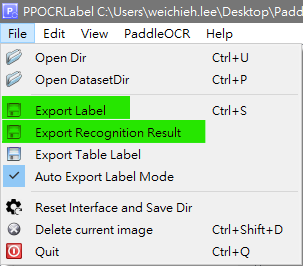

---

title:  "在 windows 使用 conda 環境搭建 OCR 訓練環境"

description: "展示使用 conda 環境搭建 OCR 訓練環境"

date: 2023-04-15

draft: false

categories:

- 技術筆記

tags:

- 教學
- OCR

keywords:

- 教學
- OCR

---


## 說明

- 使用`PaddlePaddle`平台中的模組**`PP-OCRv3`**作為示範，詳細訓練方法請參閱[官方文檔](https://github.com/PaddlePaddle/PaddleOCR/blob/release/2.6/doc/doc_en/PP-OCRv3_introduction_en.md)。
- 以下實作是在windows作業系統，並使用搭配使用 `NVIDIA GeForce RTX 2080` 進行環境建置。
- 若在訓練過程中有遇到`numpy`問題請搜尋可匹配的版本號，並重新安裝`numpy`。

## 實作

### 建立訓練環境

1. 新建`conda`環境。
    
    ```bash
    conda create -n ocr python=3.8
    conda activate ocr
    ```
    
2. 到[官方](https://www.paddlepaddle.org.cn/install/quick?docurl=/documentation/docs/zh/install/pip/windows-pip.html)點選下載選項選擇與本機匹配的`Cuda`配置，並用產生的指令去安裝`paddlepaddle-gpu`。
    
    ```bash
    python -m pip install paddlepaddle-gpu==2.3.2.post101 -f https://www.paddlepaddle.org.cn/whl/windows/mkl/avx/stable.html
    ```
    
3. 驗證有無成功安裝`paddlepaddle-gpu`。
    
    ```python
    import paddle
    paddle.utils.run_check()
    # 如果有會跳出成功字樣
    ```
    
4. 安裝`PaddleOCR`
    
    ```bash
    # Clone PaddleOCR（Inference+training）
    git clone https://github.com/PaddlePaddle/PaddleOCR
    cd PaddleOCR
    pip install -r requirements.txt
    ```
    
5. 安裝`PPOCRLabel`
    
    ```bash
    pip install PPOCRLabel
    ```
    

### 標註資料

1. 在`PaddleOCR`專案中新增資料夾，資料集結構如下，此範例將訓練集與測試集當作同一個來源。
    
    ```
    .
    └── train_data ── data
                      ├   ...
                      ├── image0.jpg
                      └── image1.jpg
    ```
    
2. 啟動標註軟體
    
    ```bash
    conda activate ocr
    PPOCRLabel
    ```
    
3. 開始標記。標記完成後要存取 `Label.txt` 和 `crop_img`資料，如下圖綠色區域。
    
    
    
4. 最終數據集結構會類似如下。
    
    ```
    .
    └── train_data ── data
                      ├   ...
                      ├── image0.jpg
                      ├── image1.jpg
                      ├── Label.txt
                      ├── rec_gt.txt
                      └── crop_img
    ```
    

### 建立 Det 訓練設定

1. [點擊此連結](https://github.com/PaddlePaddle/PaddleOCR/blob/release/2.6/doc/doc_ch/models_list.md)。下載預訓練模型。
    - 這邊下載`en_PP-OCRv3_det`模型。config檔案參照`PaddleOCR/configs/det/ch_PP-OCRv3/ch_PP-OCRv3_det_student.yml`。
2. 配置模型以及config路徑。
    
    ```
    .
    └── pretrain_models ── en_PP-OCRv3_det_distill_train
    			                  ├── best_accuracy.pdparams
    			                  ├── student.pdparams
    			                  └── config.yml
    ```
    
3. 調整`config.yml`內容
    
    ```yaml
    
    Global:
    	pretrained_model: ./pretrain_models/en_PP-OCRv3_det_distill_train/student
    				.
    				.
    Train:
      dataset:
        data_dir: ./train_data/
        label_file_list:
          - ./train_data/data/Label.txt
    				.
    				.
    	loader:
    	    **batch_size_per_card: 2**
    				.
    				.
    Eval:
      dataset:
        data_dir: ./train_data/
        label_file_list:
          - ./train_data/data/Label.txt
    ```
    
4. 執行訓練指令
    
    ```yaml
    # 沒有checkpoint
    python tools/train.py -c ./pretrain_models/en_PP-OCRv3_det_distill_train/config.yml
    ```
    
5. 輸出模型
    
    ```bash
    # 輸出模型
    python tools/export_model.py -c ./pretrain_models/en_PP-OCRv3_det_distill_train/config.yml -o Global.checkpoints="./output/ch_PP-OCR_V3_det/best_accuracy"  Global.load_static_weights=False Global.save_inference_dir="./inference/det/"
    ```
    

### 建立 Rec 訓練設定

1. [點擊此連結](https://github.com/PaddlePaddle/PaddleOCR/blob/release/2.6/doc/doc_ch/models_list.md)。下載預訓練模型。
    - 這邊下載`en_PP-OCRv3_rec`模型。config檔案參照 `ch_PP-OCRv3_rec_distillation.yml`。
2. 配置模型以及config路徑。
    
    ```
    .
    └── pretrain_models ── rec ── en_PP-OCRv3_rec_train
    						                  ├── best_accuracy.pdopt
    						                  ├── best_accuracy.pdparams
    						                  ├── best_accuracy.states
    						                  ├── train.log
    						                  └── config.yml
    ```
    
3. 調整`config.yml`內容
    
    ```yaml
    Global:
      pretrained_model: ./pretrain_models/en_PP-OCRv3_rec_train/best_accuracy
      character_dict_path: ppocr/utils/ic15_dict.txt
      character_type: en
      max_text_length: 10
    				.
    				.
    Architecture:
      Head:
        head_list:
          - SARHead:
              max_text_length: 10
    				.
    				.
    Train:
      dataset:
        data_dir: ./train_data/data/
        label_file_list:
    		- ./train_data/data/rec_gt.txt
    		transforms:
    		- RecConAug:
    			max_text_length: 10
    				.
    				.
      loader:
        batch_size_per_card: 2
    Eval:
      dataset:
        data_dir: ./train_data/data/
        label_file_list:
    		- ./train_data/data/rec_gt.txt
    				.
    				.
      loader:
        batch_size_per_card: 1
        num_workers: 1
    ```
    
4. 執行訓練指令
    
    ```bash
    # 沒有checkpoint
    python tools/train.py -c ./pretrain_models/en_PP-OCRv3_rec_train/config.yml
    ```
    
5. 輸出模型
    
    ```bash
    # 輸出模型
    python tools/export_model.py -c ./pretrain_models/en_PP-OCRv3_rec_train/config.yml -o Global.checkpoints="./output/v3_en_mobile/best_accuracy" Global.save_inference_dir="./inference/rec/"
    ```
    

### Inference with webcam

```python
from paddleocr import PaddleOCR
import cv2
import numpy as np

ocr = PaddleOCR(
  det_model_dir='./inference/det' ,
  rec_model_dir = './inference/rec' 
)

cap = cv2.VideoCapture(0)
while(True):
  _, frame = cap.read()
  results = ocr.ocr(frame)

  for result in results[0]:
    pts = np.array(result[0], np.int32).reshape((-1,1,2))
    cv2.polylines(frame,[pts],True,(0,255,0))
    cv2.putText(
      img=frame,
      text=result[1][0],
      org=(int(result[0][3][0]),int(result[0][3][1])),
      fontFace=cv2.FONT_HERSHEY_DUPLEX,
      fontScale=0.5,
      color=(0, 0, 255),
      thickness=1,
      lineType=cv2.LINE_AA
    )

  cv2.imshow('frame', frame)
  if cv2.waitKey(1) & 0xFF == ord('q'):
    break

cap.release()
cv2.destroyAllWindows()
```