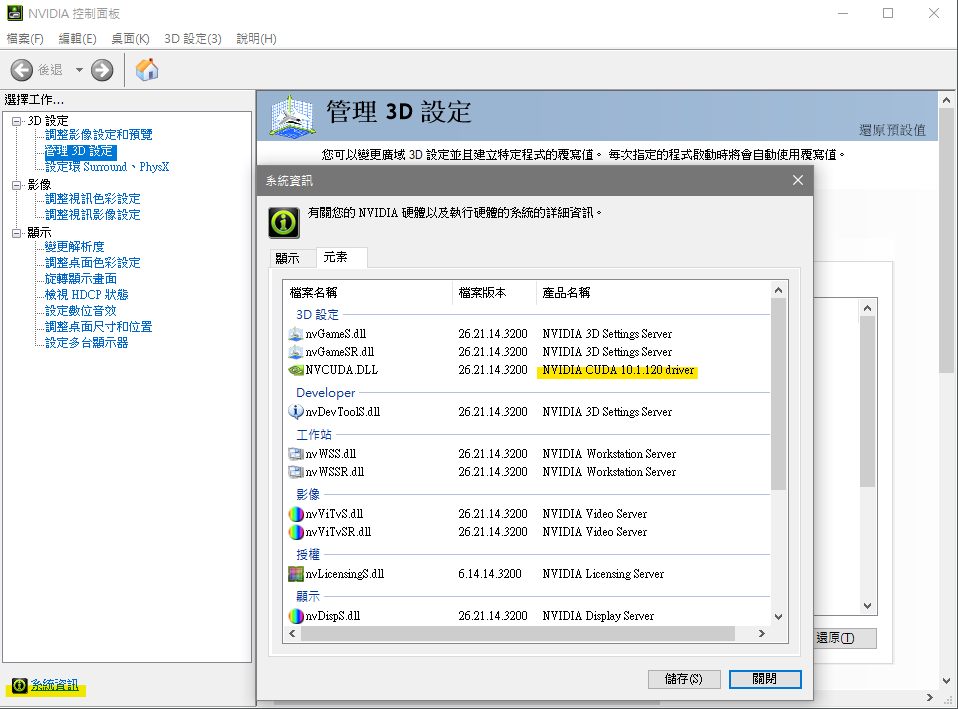
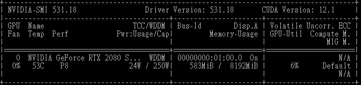
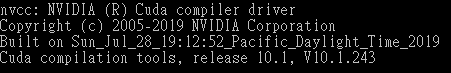
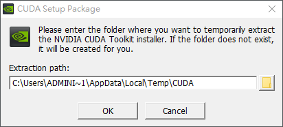
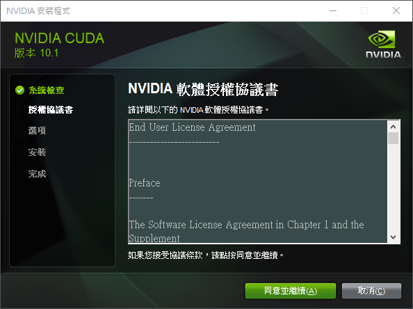
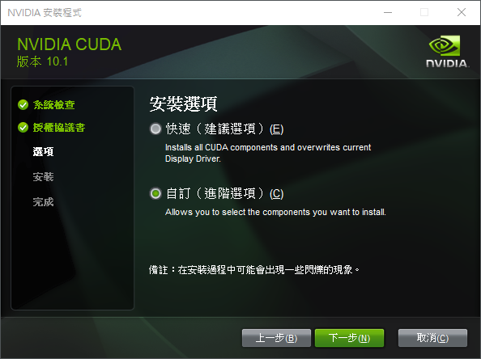
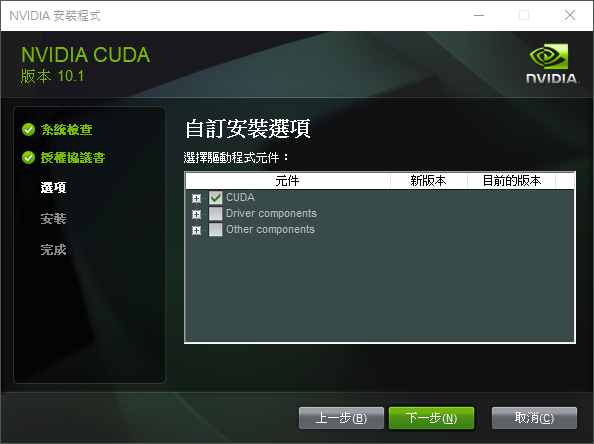
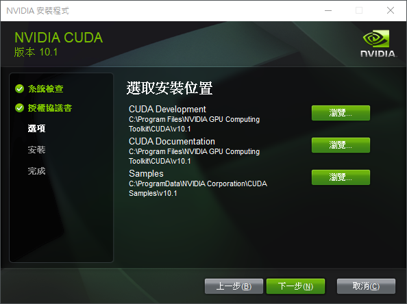
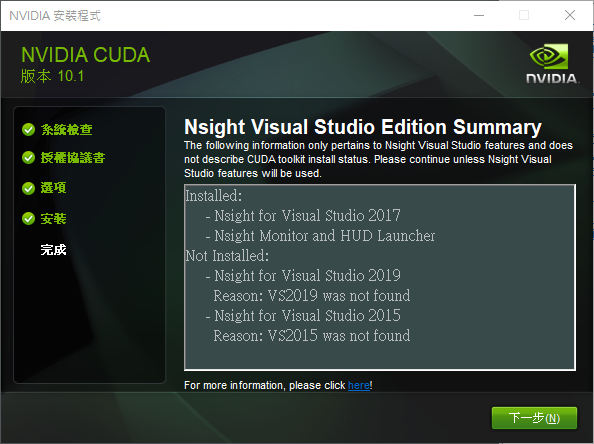
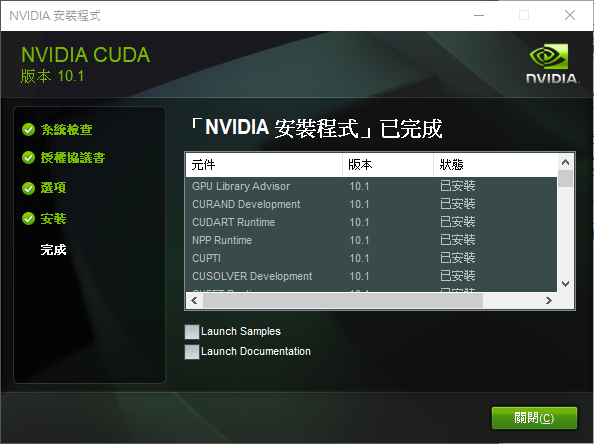

## ⏩ 說明

- CUDA 是 Nvidia 專用於平行化運算的框架。
- cuDNN（CUDA Deep Neural Network Library）是CUDA 深度學習的函式庫。
- 以下以 GeForce RTX 2080 SUPER 示範安裝CUDA和cuDNN。

## ⏩ 下載CUDA和cuDNN
> 如果是要用於 TensorFlow。請先參閱 CUDA® 和 CuDNN 版本經過測試的建構設定。
> 

### 📌查詢顯卡最高支援的 CUDA 版本
- `桌面右鍵 -> NVIDIA 控制面板 -> 左下角的系統資訊 -> 元素`。以`GeForce RTX 2080 SUPER`為例，最高支援10.1.120版本的cuda。

> 📖  補充說明
> - 在終端機輸入`nvidia-smi`指令，會跳出目前使用的顯示卡以及Cuda Driver API 的版本
> 
> - 在終端機輸入`nvcc -V`指令，會跳出目前使用的顯示卡以及Cuda runtime API 的版本
> 

### 📌確認是否要更新驅動

- 點擊[此連結](https://docs.nvidia.com/cuda/cuda-toolkit-release-notes/index.html)，查看`Table 3. CUDA Toolkit and Corresponding Driver Versions`顯卡驅動程式和 CUDA 的版本是否有對應，如果驅動程式低於CUDA版本則要更新驅動。

### 📌下載

- 點擊[此連結](https://developer.nvidia.com/cuda-toolkit-archive)下載CUDA。
- 點擊[此連結](https://developer.nvidia.com/rdp/cudnn-archive)下載cuDNN (需要登入才能下載)，注意cuDNN也要對應CUDA版本。

## ⏩ 安裝CUDA和cuDNN
### 📌 安裝CUDA

- 點擊CUDA安裝程式開始進行安裝。過程中需要注意安裝選項要選擇自訂，以及安裝元件只要選擇CUDA即可。
- 測試 CUDA 是否安裝成功。在命令列輸入指令`nvcc -V`，安裝成功會輸出 CUDA 版本資訊。

### 📌 安裝cuDNN

- 將解壓縮後所有內容複製到CUDA安裝路徑*`C:\Program Files\NVIDIA GPU Computing Toolkit\CUDA\v10.1`*即可。